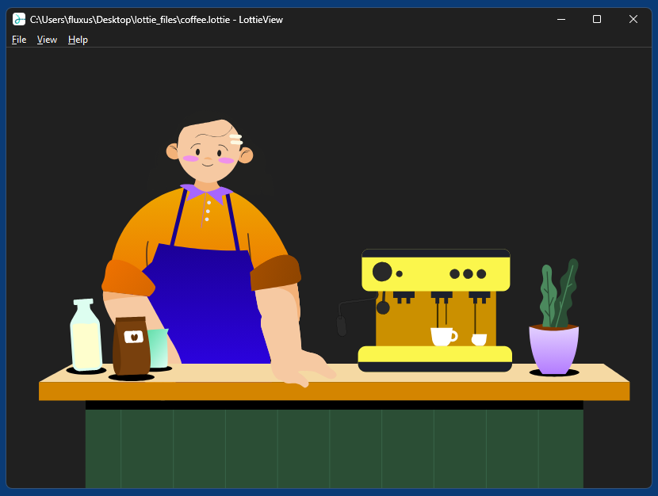

# LottieView

LottieView is a simple and small Windows desktop viewer for [Lottie animations](https://en.wikipedia.org/wiki/Lottie_(file_format)). It supports both JSON (.json, .lottie_json) and dotLottie (.lottie) files.

It's completely minimalistic, its only purpose is to quickly (pre)view an animation file by double-clicking it in Explorer, after assigning LottieView as default viewer for the corresponding file extension, e.g. .lottie. One way to do this is to select "Open with" from the Explorer context menu, then browse to the LottieView directory and select LottieView.exe, and then finally click on "Always use this app to open...".

LottieView can also load SVG files, so if you don't have a desktop viewer for SVG yet, you might also assign it as default viewer for the .svg extension.

LottieView is based on [lottie-web](https://github.com/airbnb/lottie-web), uses [Microsoft Edge WebView2](https://developer.microsoft.com/en-us/microsoft-edge/webview2) and is written in Python. It's a showcase app for WebView2 Python binding [WebView2-for-Python](https://github.com/59de44955ebd/webview2-for-python), and meant to demonstrate that you really don't always need yet another chrome engine (wasting your disk space) for every webview-based desktop app. E.g. [LottiePlayer](https://www.lottieplayer.com/), based on Electron, has a compressed installer of 120 MB, whereas the LottieView installer only has 5.8 MB.

*LottieView in Windows 11 (dark mode)*

